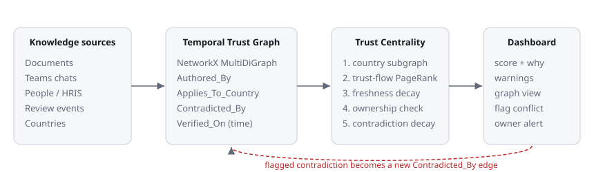
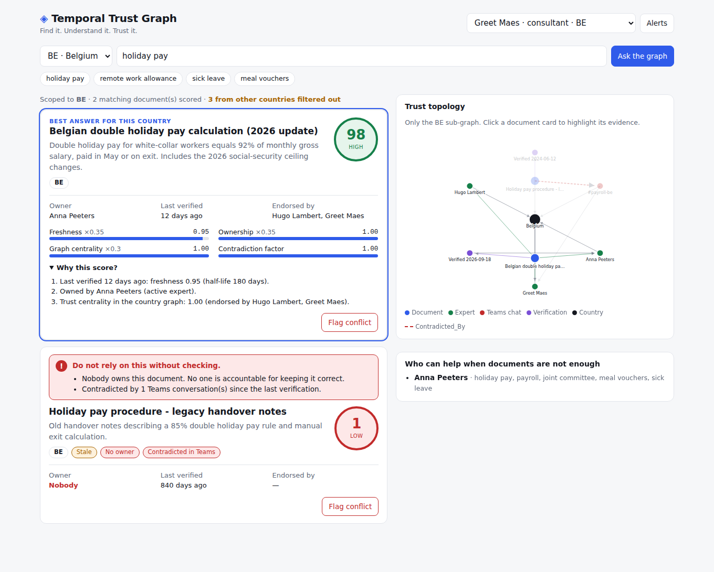

# Temporal Trust Graph

**SD Worx challenge · Tectonic Hackathon 2026 — "Find it. Understand it. Trust it."**

A search returns ten answers. The hard question is *which one can I rely on, for this country, today?*
Temporal Trust Graph models organisational knowledge as a graph and computes a **trust score from its topology and its timeline**. Every score comes with a plain-language explanation, so trust is visible instead of hidden in a black box.





## The moment of doubt we solve

A Belgian payroll consultant asks about double holiday pay. The assistant finds three documents: one recently verified, one with no owner, and one that applies to the Netherlands. Meanwhile a colleague contradicted one of them in Teams last week.

Temporal Trust Graph:

1. **Filters strictly by country.** The Dutch document never appears, and cannot lend or take trust from the Belgian answer.
2. **Ranks by trust, not keyword match.** The verified, owned, endorsed document scores 98; the orphaned legacy notes score 1.
3. **Shows why.** Freshness, ownership, graph centrality and contradiction decay each appear as a separate signal with a one-line reason.
4. **Closes the loop.** Anyone can flag a Teams contradiction. Trust drops right away and the owner, or the country experts if the document has no owner, gets an alert. When the owner re-verifies, earlier contradictions count as resolved.

## Graph model (NetworkX `MultiDiGraph`)

| Node | Meaning |
|---|---|
| `Document` | policy, procedure, handover note |
| `Employee` | expert or consultant (active / left) |
| `Country` | BE, NL, FR, DE, UK |
| `TeamsChat` | a Teams message (imported or flagged in the dashboard) |
| `Verification` | a timestamped review event |

| Edge | Direction |
|---|---|
| `Authored_By` | Document → Employee |
| `Applies_To_Country` | Document / TeamsChat → Country |
| `Contradicted_By` | Document → TeamsChat |
| `Verified_On` | Document → Verification (timestamp) |
| `Verified_By`, `Endorsed_By`, `Posted_By`, `Based_In` | supporting context |

## Trust Centrality algorithm

For a query in country **C**:

1. **Country scoping.** Build the subgraph that contains only nodes linked to `C`. Documents, chats and people tied only to other countries are dropped before any scoring.
2. **Topological centrality.** Run a personalised PageRank on a *trust-flow* graph where trust flows from active people (weighted by role) and from fresh verification events into the documents they authored, endorsed or verified. Normalise within the country.
3. **Base score.**
   `base = 0.35·freshness + 0.35·ownership + 0.30·centrality`
   * `freshness = 0.5^(days_since_verification / 180)`
   * `ownership = 1` (active owner), `0.3` (owner left), `0` (no owner)
4. **Contradiction decay.** For each `Contradicted_By` edge to a Teams chat posted **after** the last verification:
   `w = role_weight(poster) · max(0.5^(age_days/30), 0.25)`
   `factor = max(0.05, exp(-0.7 · Σw))`
5. **Score** `= 100 · base · factor` → band high (≥70), medium (≥40) or low.

All parameters sit at the top of `backend/app/graph.py`.

## API

| Method | Path | Notes |
|---|---|---|
| `POST` | `/api/query` | `{query, country}` → top document, ranked results with trust breakdown, country subgraph, experts |
| `GET` | `/api/documents/{id}?country=BE` | one document plus its trust calculation |
| `POST` | `/api/documents/{id}/conflicts` | flag a Teams contradiction → decays trust, alerts owner |
| `POST` | `/api/documents/{id}/verify` | owner / country expert / admin re-verifies |
| `GET` | `/api/notifications` | the signed-in user's own alerts |
| `POST` | `/api/auth/demo-login` | local demo only (`TTG_DEMO_LOGIN=true`) |

## Run locally

Requirements: Python 3.11+, Node 20+.

```bash
# 1. Backend
cd backend
python -m venv .venv && source .venv/bin/activate   # Windows: .venv\Scripts\activate
pip install -r requirements.txt
cp .env.example .env
#   set TTG_SECRET_KEY (python -c "import secrets; print(secrets.token_urlsafe(48))")
#   set TTG_DEMO_LOGIN=true and TTG_ENV=development for the local demo
uvicorn app.main:app --reload --port 8000 --env-file .env
pytest -q                                            # 12 tests: trust logic + security rules

# 2. Frontend (new terminal)
cd frontend
cp .env.example .env.local
npm install
npm run dev                                          # http://localhost:3000
```

**Demo path:** sign in as *Greet Maes* (BE consultant) → ask "holiday pay" → flag a conflict on "meal vouchers" → switch to *Anna Peeters* to see the alert → Re-verify.

## Security

Designed against the Aikido AI Code Audit categories. See [`docs/SECURITY.md`](docs/SECURITY.md).

* HMAC-signed, expiring bearer tokens. The signing key comes from the environment and is never committed.
* The acting user always comes from the token, never from the request body. Extra fields are rejected (`extra="forbid"`).
* Country-level authorisation on every route. Unknown and out-of-scope documents both return 404, so IDs can't be enumerated.
* Notifications are filtered by recipient, so users can't read or mark other people's alerts (no IDOR).
* Business-logic abuse guards: one open flag per user per document, owners can't flag their own document, rate limits, and re-verifying requires acknowledging contradictions. Only the owner, a country expert or an admin can verify.
* Passwordless demo login is off by default. Strict CORS, security headers and CSP are set, OpenAPI docs are hidden outside development, and errors never include stack traces.

## What's unfinished

* Data is synthetic and in-memory; a production version would ingest SharePoint/Confluence, the Teams Graph API and HRIS ownership data, and persist to a graph DB.
* The demo login stands in for SSO (Entra ID / OIDC).
* Contradiction detection is manual (flagging); the next step is an LLM classifier on Teams threads that proposes `Contradicted_By` edges for a human to confirm.

All names, documents and policies are fictional.
